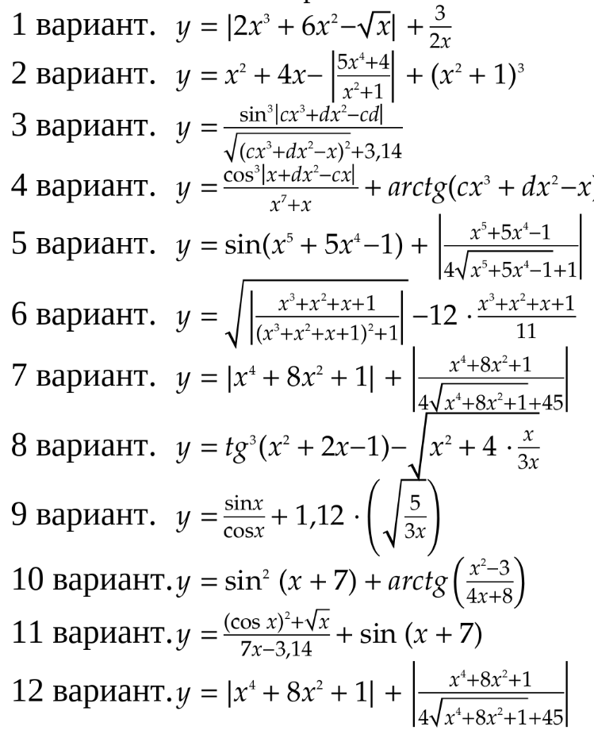

## Операции ввода-вывода. Арифметические операции в C++

**Цель работы:** Научиться создавать, компилировать и запускать линейные программы на языке программирования C++

### Основные теоритические положения
#### 1. Структура программы на C++
```cpp
#include <iostream> // Подключение библиотеки для ввода-вывода

using namespace std; // Использование стандартного пространства имён

int main() { // Главная функция программы
    // Код программы
    return 0; // Завершение программы
}
```
#### Компиляция и запуск программы
```bash
g++ *имя_файла*.cpp -o *название_файла_для компиляции*

./*название_скомпилированного_файла*
```


#### 2. Основные типы данных
- `int` - целые числа
- `double` - дробные числа
- `char` - один символ
- `string` - строка символов (требует `#include <string>`)
- `bool` - логический тип (true/false)

#### 3. Операторы ввода-вывода
- `cout <<` - вывод данных
- `cin >>` - ввод данных
- `endl` - перевод строки

#### 4. Математические операции и функции
- `+`, `-`, `*`, `/` - арифметические операции
- `sqrt(x)` - квадратный корень (требует `#include <cmath>`)
- `pow(x, y)` - возведение в степень (требует `#include <cmath>`)
- `M_PI` - число π (требует `#include <cmath>`)

---

## Задания для выполнения

**1 Программа-приветствие**
Создайте программу, которая запрашивает ваше имя и выводит персональное приветствие.

**1.2 Простой калькулятор**
Создайте программу, которая запрашивает два числа и выводит результаты их сложения, вычитания, умножения и деления. Реализуйте проверку деления на ноль.

### Часть 2. Задания для самостоятельного выполнения
**Задание 2.1 Вычисление по формуле (по вариантам)**
Напишите программу, которая вычисляет значение по формуле вашего варианта. Программа должна запрашивать необходимые исходные данные и выводить результат.

**Список вариантов:**

---
1. **Площадь круга:** S = πr²
2. **Длина окружности:** L = 2πr  
3. **Гипотенуза прямоугольного треугольника:** c = √(a² + b²)
4. **Площадь прямоугольника:** S = a × b
5. **Периметр прямоугольника:** P = 2(a + b)
6. **Среднее арифметическое трёх чисел:** avg = (a + b + c) ÷ 3
7. **Объем куба:** V = a³
8. **Площадь поверхности куба:** S = 6a²
9. **Расстояние между двумя точками на плоскости:** d = √((x₂ - x₁)² + (y₂ - y₁)²)
10. **Площадь треугольника по основанию и высоте:** S = ½ × a × h
11. **Скорость:** v = s ÷ t
12. **Плотность вещества:** ρ = m ÷ V
13. **Сила тока по закону Ома:** I = U ÷ R
14. **Работа тока:** A = U × I × t
15. **Кинетическая энергия:** Eₖ = (m × v²) ÷ 2
16. **Потенциальная энергия:** Eₚ = m × g × h (g = 9.8 м/с²)
17. **Сопротивление последовательного соединения:** R = R₁ + R₂
18. **Сопротивление параллельного соединения:** R = (R₁ × R₂) ÷ (R₁ + R₂)
19. **Перевод градусов Цельсия в Фаренгейты:** F = (9 ÷ 5) × C + 32
20. **Перевод километров в мили:** miles = km × 0.621371
21. **Вычисление процента от числа:** part = (number × percent) ÷ 100
22. **Модуль числа:** |x|
23. **Факториал числа (для n ≤ 10):** n! = 1 × 2 × 3 × ... × n
24. **Сумма цифр двузначного числа** (например, для числа 25: 2 + 5 = 7)
25. **Расчёт стоимости покупки:** total = price × quantity

**Задание 2.2**



#### 5. Тестирование
Проверьте программу на разных входных данных:
- Положительные числа
- Отрицательные числа
- Нулевые значения
- Граничные случаи

---
## Контрольные вопросы

1. Чем отличается статическая типизация в C++ от динамической в Python?
2. Какие основные типы данных в C++ вы знаете?
3. Для чего нужна директива `#include`?
4. Как предотвратить деление на ноль в программе?
5. Чем отличается оператор `=` от оператора `==` в C++?
---

## Дополнительные задания (для тех, кто выполнил основную часть)

1. Добавьте в свою программу вывод результатов с помощью функции `printf()` (потребуется `#include <cstdio>`)
2. Реализуйте ввод данных в одной строке через пробел
3. Добавьте проверку корректности ввода (что введены числа, а не текст)
4. Оформите вычисление по формуле в отдельную функцию

---
## Рекомендуемая литература

1. LearnCPP.com - лучший онлайн-учебник по C++ (на английском)
2. GeeksforGeeks.org - статьи и примеры по программированию
3. Огнева М. В., Кудрина Е. В. "Программирование на языке С++. Практический курс"
